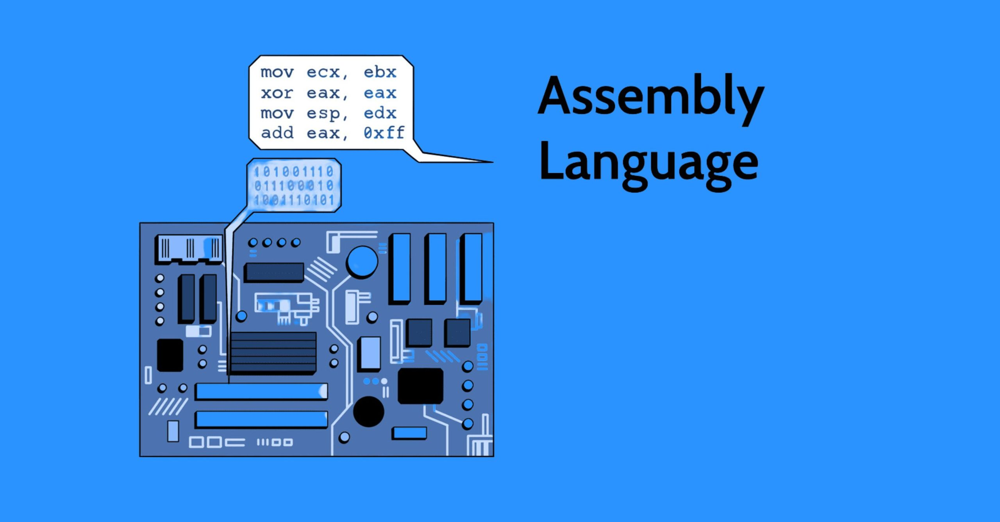
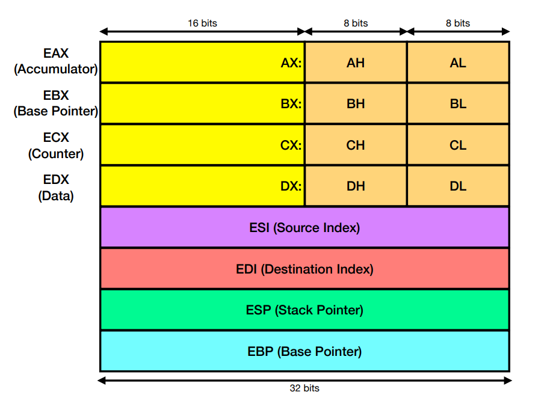
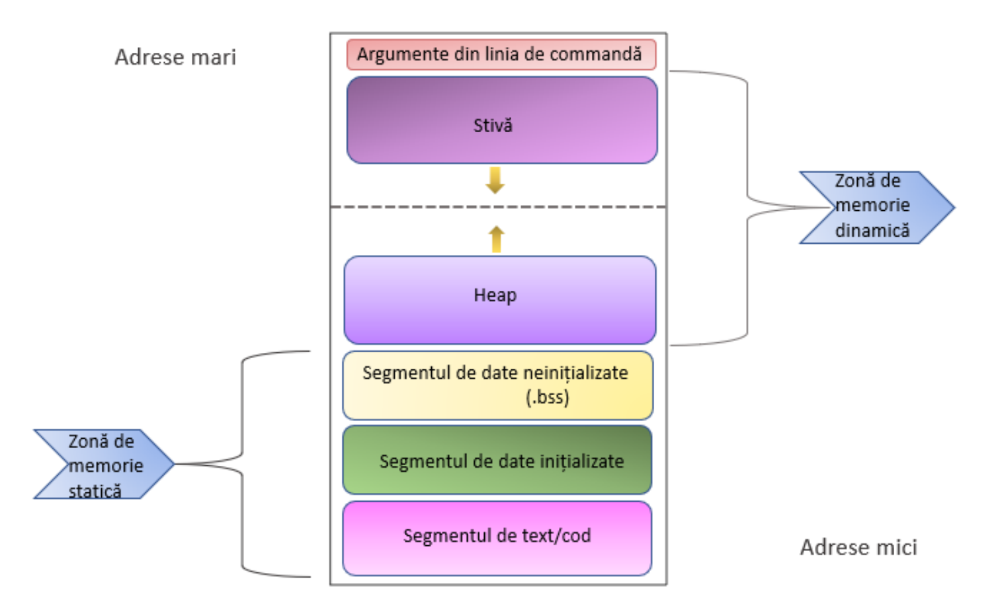
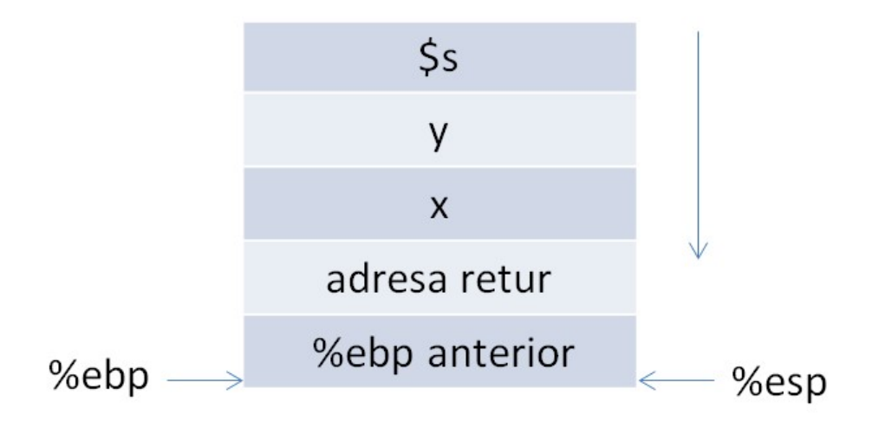

# 📘 **Assembly x86 (AT&T) Cheat Sheet**



## 📑 Table of Contents

<div style="display: flex; flex-wrap: wrap;">

  <!-- Column 1 -->
  <div style="flex: 1; min-width: 250px; margin-right: 20px;">
    <ul>
      <li><strong>🧠 Core Architecture</strong></li>
      <ul>
        <li><a href="#📌-registers-al-ah-ax-eax-rax">📌 Registers</a></li>
        <li><a href="#📌-general-purpose-registers-and-their-roles">📌 General Purpose Registers</a></li>
        <li><a href="#🧾-flags-eflags">🧾 Flags (EFLAGS)</a></li>
        <li><a href="#🏷️-operand-prefixes">🏷️ Operand Prefixes</a></li>
        <li><a href="#📍-memory-addressing">📍 Memory Addressing</a></li>
        <li><a href="#📐-data-types">📐 Data Types</a></li>
      </ul>
  <li><strong>⚙️ Program Structure</strong></li>
  <ul>
    <li><a href="#🔧-program-structure-in-assembly">🔧 Sections (.data / .text)</a></li>
    <li><a href="#📦-the-mov-instruction">📦 The <code>mov</code> Instruction</a></li>
    <li><a href="#🔍-the-lea-instruction">🔍 The <code>lea</code> Instruction</a></li>
  </ul>

  <li><strong>📞 System Calls</strong></li>
  <ul>
    <li><a href="#📊-common-linux-syscalls-x86">📊 Common Linux Syscalls</a></li>
    <li><a href="#📞-syscalls-examples">📞 Syscall Examples</a></li>
  </ul>

  <li><strong>➕ Arithmetic & Logic</strong></li>
  <ul>
    <li><a href="#➕➖-arithmetic-operations">➕➖ Arithmetic Operations</a></li>
    <li><a href="#🔗-logical-and-bitwise-operations">🔗 Logical & Bitwise</a></li>
    <li><a href="#🔀-shift--rotate">🔀 Shift & Rotate</a></li>
  </ul>
</ul>
  </div>

  <!-- Column 2 -->
  <div style="flex: 1; min-width: 250px;">
    <ul>
      <li><strong>🔁 Control Flow</strong></li>
      <ul>
        <li><a href="#🔁-jumps">🔁 Jumps (Conditional & Unconditional)</a></li>
        <li><a href="#🔄-looping-structures">🔄 Looping Structures</a></li>
      </ul>
  <li><strong>📚 Data Structures</strong></li>
  <ul>
    <li><a href="#📚-arrays">📚 Arrays</a></li>
    <li><a href="#🧱-the-stack">🧱 The Stack</a></li>
    <li><a href="#the-📥-push-and-📤-pop-instructions">📥📤 push / pop Instructions</a></li>
  </ul>

  <li><strong>🔔 Procedures & Functions</strong></li>
  <ul>
    <li><a href="#🔁-procedures-and-function-calls">🔁 Procedures & Function Calls</a></li>
    <li><a href="#the-🔔-call-and-🔙-ret-instructions">🔔 call / ret Instructions</a></li>
    <li><a href="#📞-calling-conventions">📞 Calling Conventions</a></li>
    <li><a href="#🏗️-implementation-conventions">🏗️ Implementation Conventions</a></li>
    <li><a href="#🧪-example-calling-scanf">🧪 Example: Calling scanf</a></li>
  </ul>

  <li><strong>🧬 Integration & Syntax</strong></li>
  <ul>
    <li><a href="#🧬-inline-assembly-in-c">🧬 Inline Assembly in C</a></li>
    <li><a href="#🆚-intel-vs-at&t-syntax">🆚 Intel vs AT&T Syntax</a></li>
  </ul>
</ul>
  </div>
</div>

## 📌 Registers: AL, AH, AX, EAX, RAX

- **AL** – 8-bit Low
- **AH** – 8-bit High
- **AX** – 16-bit register (AH + AL)
- **EAX** – 32-bit register (extension of AX)
- **RAX** – 64-bit register (in x86-64 architecture)

## 📌 General Purpose Registers and Their Roles

| Register | Role                | Details                     |
| -------- | ------------------- | --------------------------- |
| EAX      | Accumulator         | Arithmetic operations       |
| EBX      | Base                | Data pointer                |
| ECX      | Counter             | Used in loops               |
| EDX      | Data                | Division, I/O               |
| ESI      | Source Index        | Source                      |
| EDI      | Destination Index   | Destination                 |
| ESP      | Stack Pointer       | Top of the stack            |
| EBP      | Base Pointer        | Stack base (frame pointer)  |
| EIP      | Instruction Pointer | Address of next instruction |



## 🧾 Flags (EFLAGS)

| Flag | Name     | Description                                |
| ---- | -------- | ------------------------------------------ |
| CF   | Carry    | Set on overflow in addition/subtraction    |
| PF   | Parity   | Set if result has an even number of 1 bits |
| ZF   | Zero     | Set if result is zero                      |
| SF   | Sign     | Set if result is negative                  |
| OF   | Overflow | Set on signed overflow                     |

## 🏷️ Operand Prefixes

| Type     | Prefix   | Example |
| -------- | -------- | ------- |
| Register | `%`      | `%eax`  |
| Constant | `$`      | `$0x10` |
| Variable | _(none)_ | `msg`   |
| Address  | `$`      | `$msg`  |

## 📍 Memory Addressing

General form: `a(b, c, d)` → `a + b + c*d`

Other form: `a(b)`

Examples:

```as
movl $5, -8(%ebx, %eax, 4)
```

## 📐 Data Types

```as
.byte      - 1 byte   (8 bits)
.word      - 2 bytes  (16 bits)
.long      - 4 bytes  (32 bits)
.quad      - 8 bytes  (64 bits)
.single    - 4-byte float
.asciz     - null-terminated string
.space N   - reserves N uninitialized bytes
```

Declaration example in `.data`:

```as
x: .word 15
str: .asciz "Hello"
```

## 🔧 Program Structure in Assembly

```as
// data section
.data
    x: .long 10

// code section
.text
// entry point
.global main
// label of main
main:
    // code
    mov $1, %eax
    mov $0, %ebx
    int $0x80
```

## 📦 The `mov` Instruction

> Syntax: `mov source, destination`

> Suffixed by size: `movl`, `movb`, `movq`, etc.

```as
mov %eax, %ebx       ; EBX ← EAX
mov $5, %eax         ; EAX ← 5
mov x, %eax          ; EAX ← value of x
mov %eax, x          ; x ← EAX
```

## 🔍 The `lea` Instruction

```as
lea (%eax, %ebx, 4), %ecx
```

> Equivalent to: `ecx = eax + 4 * ebx`

## 📊 Common Linux Syscalls (x86)

| NR  | Name            | %eax (ID) | %ebx (arg0)            | %ecx (arg1)       | %edx (arg2)    |
| --- | --------------- | --------- | ---------------------- | ----------------- | -------------- |
| 0   | restart_syscall | `0x00`    | -                      | -                 | -              |
| 1   | exit            | `0x01`    | `int error_code`       | -                 | -              |
| 2   | fork            | `0x02`    | -                      | -                 | -              |
| 3   | read            | `0x03`    | `unsigned int fd`      | `char *buf`       | `size_t count` |
| 4   | write           | `0x04`    | `unsigned int fd`      | `const char *buf` | `size_t count` |
| 5   | open            | `0x05`    | `const char *filename` | `int flags`       | `umode_t mode` |
| 6   | close           | `0x06`    | `unsigned int fd`      | -                 | -              |

</br>

> 📖 Full list of syscall numbers:
> [https://chromium.googlesource.com/chromiumos/docs/+/master/constants/syscalls.md#x86-32_bit](https://chromium.googlesource.com/chromiumos/docs/+/master/constants/syscalls.md#x86-32_bit)

## 📞 SysCalls Examples

### Exit

```as
mov $1, %eax         // syscall code: exit
mov $0, %ebx         // exit code
int $0x80
```

### Write (Print Text)

```as
mov $4, %eax         // syscall code: write
mov $1, %ebx         // stdout
mov $msg, %ecx       // message
mov $len, %edx       // message length
int $0x80
```

### Read (Input from Keyboard)

```as
mov $3, %eax         // syscall code: read
mov $0, %ebx         // stdin
mov $buffer, %ecx    // buffer
mov $12, %edx        // number of bytes
int $0x80
```

## ➕➖ Arithmetic Operations

> ❗ For multiplication and division, the operand must be a register

| Instruction    | Description                   |
| -------------- | ----------------------------- |
| `add op1, op2` | op2 := op2 + op1 (op2 is reg) |
| `inc op`       | op++ (op is reg)              |
| `sub op1, op2` | op2 := op2 - op1 (op2 is reg) |
| `mul op`       | (edx, eax) := eax \* op       |
| `imul op`      | (edx, eax) := eax \* op       |
| `div op`       | (edx, eax) := (edx\:eax) / op |
| `idiv op`      | (edx, eax) := (edx\:eax) / op |

## 🔗 Logical and Bitwise Operations

| Instruction | Effect                     |
| ----------- | -------------------------- |
| `and`       | Bitwise AND                |
| `or`        | Bitwise OR                 |
| `xor`       | Bitwise XOR                |
| `not`       | Bitwise NOT                |
| `test`      | Comparison without storing |

## 🔀 Shift & Rotate

| Instruction | Effect                                  |
| ----------- | --------------------------------------- |
| `shr`       | Logical right shift                     |
| `shl`       | Logical left shift                      |
| `sar`       | Arithmetic right shift (preserves sign) |
| `sal`       | Arithmetic left shift (preserves sign)  |

## 🔁 Jumps

### Unconditional

```as
jmp label
```

### Conditional

```as
cmp %ebx, %eax     // eax ? ebx
jge label          // if eax ≥ ebx
```

### Equality Operators

| Instruction | Effect                        |
| ----------- | ----------------------------- |
| `je`        | Jump if equal (op1 == op2)    |
| `jne`       | Jump if not equal (op1 ≠ op2) |

### Unsigned Comparison Operators

| Instruction | Effect                             |
| ----------- | ---------------------------------- |
| `jb`        | Jump if below (op1 < op2)          |
| `jbe`       | Jump if below or equal (op1 ≤ op2) |
| `ja`        | Jump if above (op1 > op2)          |
| `jae`       | Jump if above or equal (op1 ≥ op2) |

### Signed Comparison Operators

| Instruction | Effect                                    |
| ----------- | ----------------------------------------- |
| `jl`        | Jump if less than (op1 < op2)             |
| `jle`       | Jump if less than or equal (op1 ≤ op2)    |
| `jg`        | Jump if greater than (op1 > op2)          |
| `jge`       | Jump if greater than or equal (op1 ≥ op2) |

### Flag-Based Operators

| Instruction | Effect                      |
| ----------- | --------------------------- |
| `jc`        | Jump if carry is set        |
| `jnc`       | Jump if carry is not set    |
| `jo`        | Jump if overflow is set     |
| `jno`       | Jump if overflow is not set |
| `jz`        | Jump if zero is set         |
| `jnz`       | Jump if zero is not set     |
| `js`        | Jump if sign is set         |
| `jns`       | Jump if sign is not set     |

## 🔄 Looping Structures

### Method 1 - Using `cmp` and `jmp`

```as
mov $0, %ecx

loop_start:
  cmp n, %ecx
  jge done

  // code

  inc %ecx
  jmp loop_start
done:
```

### Method 2 - Using `loop`

```as
mov n, %ecx

loop_start:

  // code

  loop loop_start
```

## 📚 Arrays

### Declaration:

```as
v: .long 10, 20, 30, 40
n: .long 4
```

### Access:

```as
lea v, %edi                  // load address of array
mov $2, %ecx                 // index
movl (%edi, %ecx, 4), %eax   // eax ← v[2]
```

## 🧱 The Stack

The **stack** is a region of memory used for temporary storage of data such as local variables, function parameters, and return addresses. It is part of the memory allocated to a running program.

- The stack grows **downwards**, from **higher to lower memory addresses**.
- `%esp` (Stack Pointer) always points to the **top of the stack**.
- `0(%esp)` accesses the **current top value** on the stack.

```as
// Access top of the stack
mov 0(%esp), %eax
```



> 🧠 Note: The stack is automatically adjusted using instructions like `push`, `pop`, `call`, and `ret`.

## The 📥 `push` and 📤 `pop` instructions

The `push` and `pop` instructions are used to add or remove data from the stack.

### Syntax:

```as
push operand   // Pushes operand onto the stack
pop operand    // Pops value from stack into operand
```

- **Operand** can be a register, a memory address, or a constant.
- **Only `.long` (4-byte)** values can be pushed or popped.
- Stack values are **not erased**, only **overwritten** on next `push`.

### Equivalent operations:

```as
// push x
sub $4, %esp
mov x, 0(%esp)

// pop x
mov 0(%esp), x
add $4, %esp
```

> 📌 `push` decreases `%esp` by 4 and stores the value.

> 📌 `pop` loads the top value and increases `%esp` by 4.

## 🔁 Procedures and Function Calls

Procedures (or functions) are blocks of code labeled with a name, typically defined between `.text` and `.global main`.

```as
.data
  var: .long 10
.text
proc1:
  // code
proc2:
  // code

.global main
main:
    // code
```

## The 🔔 `call` and 🔙 `ret` instructions

#### `call label`

- Saves the **return address** (value of `%eip`) on the stack.
- Then jumps to the **label**.

Equivalent to:

```as
push %eip
jmp label
```

#### `ret`

- Pops the **return address** from the stack into `%eip`.
- Returns execution to the **caller**.

Equivalent to:

```as
pop %eip
jmp %eip
```

> 📌 Used for implementing function calls and returns cleanly.

> 📌 `call` and `ret` rely on the stack to manage return addresses.

## 📞 Calling Conventions

When calling procedures, a set of rules named **calling conventions** must be followed to ensure proper argument passing, return handling, and register usage.

- Function calls are made using the `call` instruction.
- Functions return using the `ret` instruction.
- **Arguments are pushed onto the stack in reverse order** (right to left).

```as
// Example: sum(x, y)
push y          // last argument first
push x
call sum
add $8, %esp    // clean up arguments
```

> 💡 The caller is responsible for cleaning up the arguments after the call.



## 🏗️ Implementation Conventions

Procedures must follow a standard structure to maintain consistent execution and stack integrity.

### Key Rules:

- Return values are passed back through `%eax`, `%ecx`, `%edx`, or via the **top of the stack**.
- **Callee-saved registers**: `%ebx`, `%esi`, `%edi`, `%ebp`, and `%esp` must be **restored** before returning.
- `%ebp` is commonly used to create a **stable call frame** for accessing function arguments and local variables.

### Example:

```as
sum:
  push %ebp
  mov %esp, %ebp       // establish call frame
  push %ebx            // save callee-saved register

  mov 8(%ebp), %eax    // first argument
  mov 12(%ebp), %ebx   // second argument
  add %ebx, %eax       // result in %eax

  pop %ebx             // restore saved register
  pop %ebp             // restore base pointer
  ret

main:
  push y
  push x
  call sum
  add $8, %esp         // clean up arguments (2 × 4 bytes)
```

> 🧠 Use `add` instead of `pop` to avoid unnecessary register usage.


## 🧪 Example: Calling `scanf`

When calling library functions like `scanf`, the same conventions apply.

### Example:

```as
push $x               // pointer to var where input is stored
push $formatScanf     // pointer to format string (e.g. "%d")
call scanf
pop %ebx              // clean up stack
pop %ebx
```

> 📌 `scanf` returns the number of successfully read values in `%eax`.

## 🧬 Inline Assembly in C

```c
int x = 1;
__asm__(
  "mov x, %eax;"
  "add $1, %eax;"
  "mov %eax, x;"
);
```

## 🆚 Intel vs AT\&T Syntax

### 🔤 Prefixes

| Element  | Intel Syntax | AT\&T Syntax |
| -------- | ------------ | ------------ |
| Register | `eax`        | `%eax`       |
| Constant | `10`         | `$10`        |
| Address  | `[ebx]`      | `(%ebx)`     |

```as
// Intel
mov eax, 1
mov ebx, 0ffh
int 80h

// AT&T
movl $1, %eax
movl $0xff, %ebx
int $0x80
```

### 🔁 Operand Direction

| Syntax | Format                  | Example             |
| ------ | ----------------------- | ------------------- |
| Intel  | `instruction dest, src` | `mov eax, [ecx]`    |
| AT\&T  | `instruction src, dest` | `movl (%ecx), %eax` |

### 🧠 Memory Addressing

```as
// Intel
mov eax, [ebx+20h]
add eax, [ebx+ecx*2h]
lea eax, [ebx+ecx]
sub eax, [ebx+ecx*4h-20h]

// AT&T
movl 0x20(%ebx), %eax
addl (%ebx,%ecx,0x2), %eax
leal (%ebx,%ecx), %eax
subl -0x20(%ebx,%ecx,0x4), %eax
```

### 🏷️ Size & Data Types

| Type   | Intel Syntax Example       | AT\&T Syntax Equivalent |
| ------ | -------------------------- | ----------------------- |
| 8-bit  | `mov al, byte ptr [ebx]`   | `movb (%ebx), %al`      |
| 16-bit | `mov ax, word ptr [ebx]`   | `movw (%ebx), %ax`      |
| 32-bit | `mov eax, dword ptr [ebx]` | `movl (%ebx), %eax`     |
| 64-bit | `mov rax, qword ptr [rbx]` | `movq (%rbx), %rax`     |
