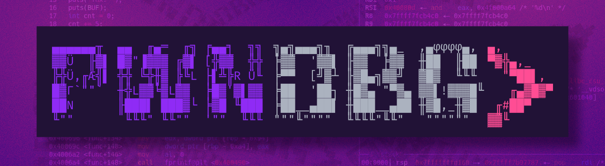

# pwndbg Cheat Sheet



## 📌 Installation & Setup

```bash
# Install pwndbg
git clone https://github.com/pwndbg/pwndbg
cd pwndbg
./setup.sh

# Start with pwndbg
gdb ./binary
```

## 🎯 Basic Navigation Commands

```bash
(gdb) b main           # Set breakpoint at main
(gdb) b *0x401000      # Set breakpoint at address
(gdb) b function+10    # Set breakpoint at offset
(gdb) r                # Run program
(gdb) r arg1 arg2      # Run with arguments
(gdb) c                # Continue execution
(gdb) s                # Step into (single instruction)
(gdb) si               # Step instruction
(gdb) n                # Next (step over)
(gdb) ni               # Next instruction
(gdb) finish           # Run until current function returns
(gdb) q                # Quit gdb
```

## 🔍 Breakpoint Management

```bash
# Setting breakpoints
b main                 # Break at function
b *0x401234           # Break at address
b file.c:42           # Break at line number
tb main               # Temporary breakpoint
watch variable        # Break when variable changes
rwatch variable       # Break when variable is read
awatch variable       # Break on read/write access

# Managing breakpoints
info breakpoints      # List all breakpoints
delete 1              # Delete breakpoint 1
delete                # Delete all breakpoints
disable 1             # Disable breakpoint 1
enable 1              # Enable breakpoint 1
clear                 # Clear breakpoint at current location
```

## 📊 Register Inspection

```bash
# pwndbg enhanced register views
regs                  # Show all registers (pwndbg style)
i r                   # Info registers (standard gdb)
i r eax               # Show specific register
i r eax ebx ecx       # Show multiple registers

# Register modification
set $eax = 0x41414141 # Set register value
set $rsp = $rsp + 8   # Modify stack pointer
```

## 🧠 Memory Examination

### Basic Memory Commands

```bash
# Examine memory (x command)
x/10x $esp            # 10 hex values from ESP
x/10i $eip            # 10 instructions from EIP
x/s 0x401000          # String at address
x/10c $rax            # 10 characters from RAX

# Format specifiers
x/x   # Hexadecimal
x/d   # Decimal
x/u   # Unsigned decimal
x/o   # Octal
x/t   # Binary
x/c   # Character
x/s   # String
x/i   # Instruction
```

### pwndbg Enhanced Memory Commands

```bash
# pwndbg memory visualization
hexdump $esp          # Hex dump from ESP
hexdump $esp 64       # 64 bytes from ESP
telescope $esp        # Smart memory view with references
telescope $esp 20     # 20 entries from ESP
vmmap                 # Show memory mappings
nearpc                # Show instructions near PC
```

## 📋 Stack Analysis

```bash
# Stack inspection
stack                 # pwndbg stack view
stack 20              # Show 20 stack entries
backtrace             # Show call stack
bt                    # Show call stack (short)
frame                 # Show current frame
frame 1               # Switch to frame 1
up                    # Move up one frame
down                  # Move down one frame

# Stack manipulation
set $esp = $esp + 4   # Adjust stack pointer
```

## 🔧 Code Analysis

```bash
# Disassembly
disass main           # Disassemble function
disass main,+20       # Disassemble 20 bytes from main
disass $eip,+10       # 10 instructions from current
u $eip                # pwndbg disassemble at EIP
u $eip 20             # 20 instructions from EIP
nearpc                # Instructions around PC
context               # Show full context (pwndbg)
```

## 🔍 Search and Find

```bash
# Search in memory
search "string"       # Search for string
search 0x41414141     # Search for value
search -t string "hello"  # Search for string type
find &system          # Find system function

# Pattern search
pattern create 100    # Create cyclic pattern
pattern offset 0x41414141  # Find offset in pattern
cyclic 100            # Generate cyclic pattern
cyclic -l 0x61616161  # Find offset of pattern
```

## 🏗️ Heap Analysis

```bash
# Heap inspection
heap                  # Show heap information
bins                  # Show heap bins
fastbins             # Show fastbins
tcache               # Show tcache bins
vis                   # Visualize heap chunks
malloc_chunk addr     # Show chunk information
```

## 🔗 Dynamic Analysis

```bash
# Process information
pmap                  # Show memory mappings
vmmap                 # pwndbg memory map
got                   # Show GOT table
plt                   # Show PLT entries
checksec              # Security mitigations check

# Library functions
plt                   # Show PLT entries
got printf            # Show GOT entry for printf
```

## 🎮 Exploitation Helpers

```bash
# ROP gadgets
rop                   # Find ROP gadgets
rop --grep "pop rdi"  # Find specific gadgets
ropper                # External ROP tool integration

# Shellcode
shellcraft            # Generate shellcode
asm "mov eax, 1"      # Assemble instruction
disasm "\x31\xc0"     # Disassemble bytes
```

## 📝 Information Gathering

```bash
# Binary information
info functions        # List all functions
info variables        # List all variables
info files            # Show loaded files
info proc mappings    # Process memory mappings
checksec              # Security features
elfheader             # ELF header information
sections              # Show sections
segments              # Show segments

# Symbol information
info address main     # Address of symbol
whatis variable       # Type information
ptype structure       # Show structure definition
```

## 🔄 Process Control

```bash
# Process management
attach PID            # Attach to running process
detach                # Detach from process
kill                  # Kill current process
core-file core        # Load core dump
generate-core-file    # Generate core dump

# Multi-threading
info threads          # Show all threads
thread 2              # Switch to thread 2
thread apply all bt   # Backtrace all threads
```

## 🎨 Customization & Configuration

```bash
# pwndbg configuration
config                # Show all configuration
set context-sections "regs code stack"  # Customize context
set telescope-limit 10    # Set telescope entries
theme                 # Show available themes

# Context control
context               # Show full context
ctx                   # Show context (short)
context code          # Show only code context
context regs          # Show only registers
context stack         # Show only stack
```

## 📊 Advanced Memory Operations

```bash
# Memory operations
dump memory file.bin $esp $esp+100  # Dump memory to file
restore file.bin binary $esp        # Restore memory from file
compare-sections                     # Compare memory sections

# Memory protection
vmmap addr            # Check memory protection at address
mprotect addr size prot  # Change memory protection
```

## 🔍 Debugging Techniques

### Buffer Overflow Analysis

```bash
# Set up environment
set environment COLUMNS=200
set environment LINES=50
b main
r $(python -c "print 'A'*100")

# Analyze crash
info registers
x/10x $esp
bt
```

### Format String Analysis

```bash
# Test format string
r %x.%x.%x.%x.%x
telescope $esp
# Look for stack values
```

### Return-to-libc Analysis

```bash
# Find system function
p system
# Find "/bin/sh" string
search "/bin/sh"
# Check stack layout
telescope $esp 20
```

## 🛡️ Security Analysis

```bash
# Check binary protections
checksec              # All protections
checksec --file=binary # File-specific check

# ASLR status
cat /proc/sys/kernel/randomize_va_space

# Stack canary detection
info functions __stack_chk_fail
```

## 📱 Mobile/ARM Debugging

```bash
# ARM-specific commands
i r r0 r1 r2 r3       # ARM argument registers
i r lr pc sp          # Important ARM registers
x/i $pc               # Current instruction (ARM)
set architecture arm  # Set ARM architecture
```

## 🔧 Scripting & Automation

```bash
# GDB scripting
source script.gdb     # Load GDB script
python print("Hello") # Execute Python
python-interactive    # Python shell

# Logging
set logging on        # Enable logging
set logging file log.txt # Set log file
```

## ⚡ Quick Reference Commands

### Essential pwndbg Commands

```bash
start                 # Start and break at entry
init                  # Initialize/restart
ctx                   # Show context
telescope $esp        # Smart stack view
vmmap                 # Memory layout
checksec              # Security check
search "string"       # Find string
pattern create 100    # Create pattern
cyclic 100           # Generate cyclic
disass main          # Disassemble
```

### One-liners for Common Tasks

```bash
# Find RIP control
python print("A" * 100)
# Generate pattern
pattern create 200
# Find offset
pattern offset $rip
# Check protections
checksec
```

## 🔍 Memory Layout Analysis

```bash
# Understand the stack
info proc mappings    # Full memory map
vmmap stack           # Stack region only
vmmap heap            # Heap region only
vmmap libc            # libc mapping

# Library analysis
ldd binary            # Show linked libraries
info shared           # Loaded shared libraries
```

## 🎯 Exploitation Workflow

1. **Reconnaissance**

   ```bash
   checksec
   info functions
   disass main
   ```

2. **Vulnerability Discovery**

   ```bash
   pattern create 200
   r $(python -c "print 'A'*200")
   pattern offset $rip
   ```

3. **Exploit Development**

   ```bash
   search "/bin/sh"
   p system
   rop --grep "pop rdi"
   ```

4. **Payload Testing**
   ```bash
   r $(python exploit.py)
   telescope $esp
   continue
   ```

## 🚀 Pro Tips

- Use `context` after each step to see full state
- `telescope` is your best friend for stack analysis
- `pattern create/offset` for finding buffer overflows
- `vmmap` to understand memory layout
- `checksec` to identify available mitigations
- Use `search` to find strings and gadgets
- `heap` and `bins` for heap exploitation
- Save frequently used commands in `.gdbinit`
