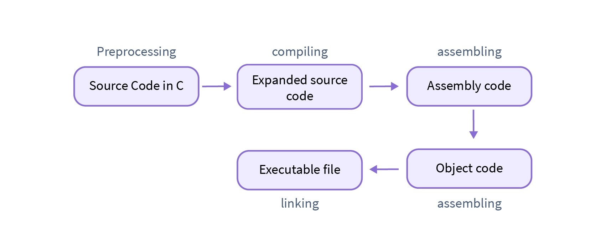

# **C Programming Language Cheat Sheet**


## 📑 Table of Contents

<div style="display: flex; flex-wrap: wrap;">

  <!-- Column 1 -->

  <div style="flex: 1; min-width: 250px; margin-right: 20px;">
    <ul>
      <li><strong>🧠 Core Language Concepts</strong></li>
      <ul>
        <li><a href="#🎯-program-entry-point">🎯 Program Entry Point</a></li>
        <li><a href="#📚-essential-headers">📚 Essential Headers</a></li>
        <li><a href="#📌-basic-data-types">📌 Basic Data Types</a></li>
        <li><a href="#🔄-type-casting">🔄 Type Casting</a></li>
          <li><a href="#🔒-storage-class-specifiers">🔒 Storage Class Specifiers</a></li>
          <li><a href="#⚙️-the-inline-keyword">⚙️ The inline Keyword</a></li>
          <li><a href="#🔐-type-qualifiers">🔐 Type Qualifiers</a></li>
        <li><a href="#🎯-error-handling">🎯 Error Handling</a></li>
      </ul>

  <li><strong>🧩 Data Organization</strong></li>
  <ul>
    <li><a href="#🧩-aggregated-types-struct-union-enum">🧩 Aggregated Types</a></li>
    <li><a href="#✍️-typedef-aliasing">✍️ Typedef (Aliasing)</a></li>
  </ul>

  <li><strong>💾 Memory & Pointers</strong></li>
  <ul>
    <li><a href="#🔗-pointers">🔗 Pointers</a></li>
    <li><a href="#🎯-function-pointers">🎯 Function Pointers</a></li>
    <li><a href="#🔄-parameter-passing">🔄 Parameter Passing</a></li>
    <li><a href="#💾-dynamic-memory-allocation">💾 Dynamic Memory Allocation</a></li>
  </ul>
</ul>

  </div>

  <!-- Column 2 -->

  <div style="flex: 1; min-width: 250px;">
    <ul>
      <li><strong>⚙️ Operations</strong></li>
      <ul>
        <li><a href="#🔢-bitwise-operations">🔢 Bitwise Operations</a></li>
        <li><a href="#🔤-string-manipulation-in-c">🔤 String Manipulation in C</a></li>
      </ul>

  <li><strong>📥 In/Out Manipulation</strong></li>
  <ul>
    <li><a href="#📥📤-inputoutput-functions">📥📤 Input/Output Functions</a></li>
    <li><a href="#🧾-puts-vs-printf-gets-vs-scanf-f-functions">🧾 puts vs printf, gets vs scanf, f* Functions</a></li>
  </ul>

  <li><strong>🧱 Preprocessing & Compilation</strong></li>
  <ul>
    <li><a href="#📚-headers-h">📚 Headers</a></li>
    <li><a href="#⚙️-macros-define-undef">⚙️ Macros</a></li>
    <li><a href="#🧰-conditional-compilation--error-directives">🧰 Conditional Compilation</a></li>
    <li><a href="#🔧-gcc-compilation">🔧 GCC Compilation</a></li>
    <li><a href="#🧩-c-compilation-process">🧩 C Compilation Process</a></li>
  </ul>

  <li><strong>🖥️ System-Level Programming</strong></li>
  <ul>
    <li><a href="#📂-system-types-systypesh">📂 System Types</a></li>
    <li><a href="#🖥️-system-calls">🖥️ System Calls</a></li>
    <li><a href="#🔢-exit-codes">🔢 Exit Codes</a></li>
    <li><a href="#⚙️-inline-assembly">⚙️ Inline Assembly</a></li>
  </ul>
</ul>

  </div>

</div>

## 🎯 Program Entry Point

### Basic Program Structure

```c
#include <stdio.h>

int main() {
    printf("Hello, World!\n");
    return 0;
}
```

### Full main() Function Signature

```c
int main(int argc, char** argv, char** envp)
```

- **argc** - argument count
- **argv** - argument values (array of strings)
- **envp** - environment variables (array of strings)

### Command Line Arguments Example

```c
#include <stdio.h>

int main(int argc, char** argv) {
    printf("Number of arguments: %d\n", argc);
    for (int i = 0; i < argc; i++) {
        printf("argv[%d]: %s\n", i, argv[i]);
    }
    return 0;
}
```

## 📚 Essential Headers

| Header     | Purpose           | Key Functions                      |
| ---------- | ----------------- | ---------------------------------- |
| `stdio.h`  | Standard I/O      | `printf()`, `scanf()`, `fopen()`   |
| `stdlib.h` | General utilities | `malloc()`, `free()`, `exit()`     |
| `string.h` | String operations | `strlen()`, `strcpy()`, `strcmp()` |
| `math.h`   | Math functions    | `sqrt()`, `pow()`, `sin()`         |
| `ctype.h`  | Character testing | `isdigit()`, `isalpha()`           |
| `time.h`   | Date and time     | `time()`, `clock()`                |
| `unistd.h` | UNIX standard     | `read()`, `write()`, `close()`     |
| `fcntl.h`  | File control      | `open()`, file flags               |

## 📌 Basic Data Types

| Type            | Size    | Range                           | Description        |
| --------------- | ------- | ------------------------------- | ------------------ |
| `char`          | 1 byte  | -128 to 127                     | Single character   |
| `unsigned char` | 1 byte  | 0 to 255                        | Unsigned character |
| `short int`     | 2 bytes | -32,768 to 32,767               | Short integer      |
| `int`           | 4 bytes | -2,147,483,648 to 2,147,483,647 | Standard integer   |
| `long long int` | 8 bytes | Very large range                | Long integer       |
| `float`         | 4 bytes | \~6-7 decimal digits            | Single precision   |
| `double`        | 8 bytes | \~15-17 decimal digits          | Double precision   |

### 📏 Size Check Example

```c
printf("%d\n", sizeof(int));
```

### 📚 Limits with `<limits.h>`

To retrieve implementation-specific limits for integral types, include the `<limits.h>` header.

```c
#include <limits.h>
```

### 🔑 Common Limits from `<limits.h>`

| Macro        | Description                       | Example Value             |
| ------------ | --------------------------------- | ------------------------- |
| `CHAR_BIT`   | Number of bits in a `char`        | 8                         |
| `CHAR_MIN`   | Minimum value of `char`           | -128                      |
| `CHAR_MAX`   | Maximum value of `char`           | 127                       |
| `INT_MIN`    | Minimum value of `int`            | -2,147,483,648            |
| `INT_MAX`    | Maximum value of `int`            | 2,147,483,647             |
| `UINT_MAX`   | Maximum value of `unsigned int`   | 4,294,967,295             |
| `LONG_MIN`   | Minimum value of `long`           | Typically −2,147,483,648  |
| `LONG_MAX`   | Maximum value of `long`           | Typically 2,147,483,647   |
| `ULONG_MAX`  | Max value of `unsigned long`      | 4,294,967,295 or higher   |
| `LLONG_MIN`  | Minimum value of `long long`      | Very large negative value |
| `LLONG_MAX`  | Maximum value of `long long`      | Very large positive value |
| `ULLONG_MAX` | Max value of `unsigned long long` | Max unsigned 64-bit value |

Use these constants to write portable, safe programs across different systems.

## 🔄 Type Casting

### 💡 Implicit/Explicit Casting

```c
int total = 100;
int count = 7;

// average_implicit will be 14.00
float average_implicit = total / count;

// average_explicit will be 14.2857...
float average_explicit = (float)total / count;
```

### 📏 Size and Signedness Conversions

| Conversion Type     | Description                                                              | Effect                                                     |
| :------------------ | :----------------------------------------------------------------------- | :--------------------------------------------------------- |
| **Widening**        | Converting from a smaller type to a larger type (e.g., `int` to `long`). | Generally safe, preserves the value.                       |
| **Narrowing**       | Converting from a larger type to a smaller type (e.g., `long` to `int`). | **Dangerous**; can lead to **truncation**                  |
| **Signed/Unsigned** | Converting between signed and unsigned types.                            | 32 bits stay the same, so -1 $\to$ 4294967295 (0xffffffff) |

### 🔑 Advanced Type Casting: Pointers

Casting pointers is an advanced technique, often used in system programming, memory management, and low-level I/O.

1.  **`void *` Casting (General Pointers):** The `void *` type is a generic pointer that can hold the address of _any_ data type. Standard library functions like `malloc()` return `void *`.

    ```c
    // Allocation returns void*, must be cast to the desired type
    int *int_ptr = (int *)malloc(sizeof(int));

    // Casting back to void * is implicit and fine
    void *generic_ptr = int_ptr;
    ```

2.  **Pointer-to-Pointer Casting:** Used when you need to access raw memory or reinterpret data structures

    ```c
    int x = 0x12345678;
    unsigned char *byte_ptr = (unsigned char *)&x;

    printf("First byte: 0x%x\n", byte_ptr[0]);
    ```

3.  **Function Pointer Casting:** Used to cast a function pointer to another function pointer type, typically to create generic callbacks or interface with foreign code (e.g., dynamic libraries).

## 🔒 Storage Class Specifiers

Storage class specifiers determine the **lifetime** and **visibility** (_scope_) of variables and functions.

| Specifier  | Lifetime                                                                                      | Visibility (Scope)                                                                          |
| :--------- | :-------------------------------------------------------------------------------------------- | :------------------------------------------------------------------------------------------ |
| `auto`     | Local: Allocated on the **stack**, destroyed on block exit (default for local variables).     | Local (within the block/function).                                                          |
| `register` | Local (on stack): Suggests the compiler use a CPU **register** (if possible) for fast access. | Local (within the block/function).                                                          |
| `static`   | **Global**: Lifetime is for the entire duration of the program (like global variables).       | **Local** or **File-Local**: Limits visibility to the current function or the current file. |
| `extern`   | Global: Lifetime is for the entire duration of the program.                                   | **Global**: Variable/function is defined in another source file (translation unit).         |

### 🛑 The `static` Keyword

> `static` can't be used in `struct`

The `static` keyword has two main uses depending on the context:

#### 1\. Local `static` (Inside a Function)

- **Global Lifetime**: The variable is allocated only once and **retains its value** between function calls.
- **Local Visibility**: The variable can only be accessed from within the function where it is declared.
- It is initialized to **zero** upon the first call (if no explicit value is given).

<!-- end list -->

```c
#include <stdio.h>

void counter() {
    static int count = 0;
    count++;
    printf("Call: %d\n", count);
}

int main() {
    counter(); // Call: 1
    counter(); // Call: 2
    return 0;
}
```

#### 2\. Global `static` (Outside a Function)

- Applied to global variables or functions.
- **File-Level Visibility**: Limits the visibility of the variable or function to the specific source file (`.c` file) in which it is declared.
- This prevents name clashes with variables or functions of the same name defined in other files.

<!-- end list -->

```c
// file: util.c

// 'secret_data' is only visible inside util.c
static int secret_data = 100;

// 'internal_func' is only accessible inside util.c
static void internal_func() {
    // ...
}
```

### 🌍 The `extern` Keyword

- **Declares, not Defines**: `extern` is used to declare a global variable or function that is **defined** (allocated memory and/or implemented) in a different compilation unit (another `.c` file).
- It is essential for **linking** multi-file programs.

#### 📝 Multi-File Example

```c
// file: data.c (The Definition)
int global_counter = 0; // The definition (memory allocation)

void increment_counter() {
    global_counter++;
}
```

```c
// file: main.c (The Declaration/Usage)
#include <stdio.h>

// The declaration: Tells the compiler global_counter is defined elsewhere
extern int global_counter;
extern void increment_counter(); // Often implicit for functions

int main() {
    printf("Initial: %d\n", global_counter); // 0
    increment_counter();
    printf("After call: %d\n", global_counter); // 1
    return 0;
}
```

**Note**: The `extern` declaration for functions is often implicit in C. However, using `extern` explicitly for global variables in the file that uses them (but doesn't define them) is good practice.

## ⚙️ The `inline` Keyword

`inline` suggests to the compiler to **replace a function call with the function’s body**, improving performance by eliminating call overhead.

### 🧩 Basic Syntax

```c
inline int square(int x) {
    return x * x;
}
```

> The compiler **may ignore** the `inline` request—it’s only a hint.

### 🧱 Storage Class Interactions

| Specifier       | Meaning                                                                                     | Linkage  |
| --------------- | ------------------------------------------------------------------------------------------- | -------- |
| `inline`        | Function can be inlined. If not `extern` or `static`, has **external linkage**.             | External |
| `static inline` | Inlined **within this translation unit only** (cannot be linked elsewhere).                 | Internal |
| `extern inline` | Provides an **inline definition**, but expects an external non-inline definition elsewhere. | External |

## 🔐 Type Qualifiers

Type qualifiers modify how variables are stored, accessed, or optimized.

| Qualifier  | Purpose                                                                                                                             | Example                                                             |
| ---------- | ----------------------------------------------------------------------------------------------------------------------------------- | ------------------------------------------------------------------- |
| `const`    | Marks a variable as **read-only** (cannot be modified after initialization).                                                        | `const int x = 5;`                                                  |
| `volatile` | Prevents compiler optimizations for variables that may **change unexpectedly** (e.g., hardware registers, signals, multithreading). | `volatile int status_reg;`                                          |
| `restrict` | Promises that a pointer is the **only reference** to its memory region (enables aggressive optimization).                           | `void copy(int *restrict dest, const int *restrict src, size_t n);` |

### 🔒 `const`

> In C the body can't be const like C++

```c
void print_value(const int *ptr) {
    // *ptr = 10;  ❌ ERROR - read-only
    printf("%d\n", *ptr);
}
```

### ⚡ `volatile`

Used in embedded programming or multithreading:

```c
volatile int flag = 0;

void interrupt_handler() {
    flag = 1; // Changed asynchronously
}

int main() {
    while (flag == 0) {
        // Compiler will NOT optimize this loop away
    }
    printf("Flag set!\n");
}
```

### 🚀 `restrict`

```c
void add_arrays(int *restrict a, int *restrict b, int *restrict result, int n) {
    for (int i = 0; i < n; ++i)
        result[i] = a[i] + b[i];
}
```

> Here, restrict is telling the compiler that `a`, `b`, and `result` are the ONLY references to the values that are pointing to in their scope, so it can safely optimize memory loads/stores.

## 🎯 Error Handling

```c
#include <errno.h>
#include <string.h>

FILE *file = fopen("nonexistent.txt", "r");
if (file == NULL) {
    fprintf(stderr, "Error: %s\n", strerror(errno));
    return 1;
}
```

## 🧩 Aggregated Types: Struct, Union, Enum

### 🧱 Struct

A **structure** (`struct`) is a user-defined data type that aggregates logically related variables (members) of potentially **different** data types under a single name. All members of a struct are stored in **separate memory locations**.

#### 📝 Definition and Usage

```c
struct Point {
    int x;
    int y;
};

struct Point p1;
p1.x = 10;
p1.y = 20;

// Initializer list
struct Point p2 = {5, 15};
```

#### 💾 Memory Layout (Padding)

The compiler often inserts **padding** (unused bytes) between members to align them on memory boundaries, which improves access speed. `sizeof(struct)` is often greater than the sum of the sizes of its members.

### ⚛️ Union

A **union** is a user-defined data type that can hold members of potentially different data types, but **only one member can hold a value at any given time**. All members share the **same memory location**. The size of a union is equal to the size of its largest member.

#### 📝 Definition and Usage

```c
union Value {
    int i;
    float f;
    char s[20];
};

union Value v;
v.i = 42;
printf("Int: %d\n", v.i);
v.f = 3.14;
// v.i is now a reinterpretation of 3.14 as an int
printf("Float: %f\n", v.f);
```

#### 📝 Example:

```c
typedef union {
    unsigned int addr;
    unsigned char bytes[4];
} ipv4_addr;

ipv4_addr myaddr = {0}

myaddr.bytes[0] = 127;
myaddr.bytes[1] = 0;
myaddr.bytes[2] = 0;
myaddr.bytes[3] = 1;

printf("%x\n", myaddr.addr);
```

### 🏷️ Enumeration

An **enumeration** (`enum`) is a list of named integer constants. It makes code more readable by assigning meaningful names to integer values. By default, the first enumerator has the value 0, and subsequent enumerators have a value 1 greater than the previous one.

#### 📝 Definition and Usage

```c
enum Day {
    MON = 1, // Explicitly start at 1
    TUE,     // Automatically 2
    WED,     // Automatically 3
    THU,
    FRI,
    SAT,
    SUN
};

enum Day today = WED;

if (today >= SAT) {
    printf("It's the weekend!\n");
}
```

## ✍️ Typedef (Aliasing)

The `typedef` keyword is used to create an **alias** (a new name) for an existing data type. It is most frequently used with structures, unions, and enumerations to simplify declarations.

### ❌ Without `typedef`

```c
struct Person {
    char name[50];
    int age;
};

struct Person student;
```

### ✅ With `typedef`

```c
typedef struct {
    char name[50];
    int age;
} Person;

Person student;
student.age = 25;
```

#### 🔗 Self-Referential Structures

When a structure needs to reference itself (e.g., for linked lists or trees), you still need the internal `struct` tag to define the pointer within the structure.

```c
typedef struct Node {
    int data;
    struct Node *next;
} Node;
```

## 🔗 Pointers

### Declaration and Usage

```c
int *ptr;                    // Declare pointer
ptr = (int*)malloc(sizeof(int)); // Allocate memory
*ptr = 42;                   // Set value
printf("Value: %d\n", *ptr); // Access value
free(ptr);                   // Free memory
```

### Pointer Operators

| Operator | Description | Example     |
| -------- | ----------- | ----------- |
| `&`      | Address-of  | `&variable` |
| `*`      | Dereference | `*pointer`  |

## 🎯 Function Pointers

A **function pointer** is a variable that stores the memory address of a function. This allows functions to be passed as arguments to other functions, stored in arrays, or returned from functions, enabling highly flexible and dynamic programming patterns (like callbacks or dispatch tables).

### 📝 Declaration Syntax

The syntax can be complex, but it logically replaces the function name with `(*pointer_name)`.

```c
int add(int a, int b) {
    return a + b;
}

// Syntax:
// return_type (*pointer_name)(parameter_types)
int (*operation)(int, int);

operation = add;
int result = operation(5, 3);
// or
int result_alt = (*operation)(5, 3);
```

### 📞 Callbacks

Function pointers are the core mechanism for **callback functions**, where one function calls a function provided by the caller.

```c
void perform_operation(int x, int y, int (*func)(int, int)) {
    int result = func(x, y);
    printf("Result: %d\n", result);
}

perform_operation(10, 5, add);
```

## 🔄 Parameter Passing

### Pass by Value

```c
void modify_value(int x) {
    x = 100;  // Only changes local copy
}
```

### Pass by Reference (using pointers)

```c
void modify_reference(int *x) {
    *x = 100;  // Changes original value
}
```

### Arrays (implicitly passed by reference)

```c
void modify_array(int arr[], int size) {
    arr[0] = 999;  // Changes original array
}
```

## 💾 Dynamic Memory Allocation

Dynamic memory allocation allows a program to request memory at **runtime** (during execution) from an area called the **heap**, unlike static allocation (on the stack or global) which occurs at compile time or program startup.

### 🔑 Standard Functions

These functions require the inclusion of the **`<stdlib.h>`** header.

| Function  | Signature (Simplified)                      | Description                                                                                              |
| :-------- | :------------------------------------------ | :------------------------------------------------------------------------------------------------------- |
| `malloc`  | `void* malloc(size_t size)`                 | Allocates `size` bytes of **uninitialized** memory and returns a `void*` pointer (or `NULL` on failure). |
| `calloc`  | `void* calloc(size_t num, size_t size)`     | Allocates memory for an array of `num` elements of size `size` and **initializes all bytes to zero**.    |
| `realloc` | `void* realloc(void* ptr, size_t new_size)` | **Resizes** the memory block previously allocated at `ptr` to `new_size` bytes. It may move the block.   |
| `free`    | `void free(void* ptr)`                      | **Deallocates** the memory block pointed to by `ptr`. After `free`, `ptr` becomes a _dangling pointer_.  |

### 📝 `malloc` Usage Example

```c
#include <stdlib.h>
#include <stdio.h>

int main() {
    // 1. Allocate space for 5 integers
    int num_elements = 5;
    int *arr = (int *)malloc(num_elements * sizeof(int));

    // 2. Error Check
    if (arr == NULL) {
        perror("Error allocating memory");
        return 1;
    }

    // 3. Usage (e.g., initialization)
    for (int i = 0; i < num_elements; i++) {
        arr[i] = i * 10;
    }

    // 4. Deallocate
    free(arr);
    arr = NULL; // Prevent dangling pointer

    return 0;
}
```

## 🔢 Bitwise Operations

### Bitwise Operators

| Operator | Name        | Example  | Description             |
| -------- | ----------- | -------- | ----------------------- |
| `\|`     | OR          | `x \| y` | Bitwise OR              |
| `&`      | AND         | `x & y`  | Bitwise AND             |
| `^`      | XOR         | `x ^ y`  | Bitwise XOR             |
| `~`      | NOT         | `~x`     | Bitwise NOT             |
| `<<`     | Left Shift  | `x << n` | Shift left n positions  |
| `>>`     | Right Shift | `x >> n` | Shift right n positions |

### Truth Table

| x   | y   | x\|y | x&y | x^y |
| --- | --- | ---- | --- | --- |
| 0   | 0   | 0    | 0   | 0   |
| 0   | 1   | 1    | 0   | 1   |
| 1   | 0   | 1    | 0   | 1   |
| 1   | 1   | 1    | 1   | 0   |

### Shift Operations

```c
int x = 8;        // Binary: 1000
int left = x << 1;  // 16 (multiply by 2)
int right = x >> 1; // 4  (divide by 2)
```

## 🔤 String Manipulation in C

### 📚 String Library (`<string.h>`)

To work with strings in C, you use functions provided by the standard **`<string.h>`** library:

```c
#include <string.h>

char str1[50] = "Hello";
char str2[] = "World";
char dest[100];
```

### 🔧 Common String Functions

| Function                   | Description                                                               |
| -------------------------- | ------------------------------------------------------------------------- |
| `strlen(s)`                | Returns the length of string `s` (excluding the null terminator).         |
| `strcpy(dest, src)`        | Copies the string `src` into `dest`.                                      |
| `strncpy(dest, src, n)`    | Copies up to `n` characters from `src` to `dest`.                         |
| `strcat(dest, src)`        | Appends string `src` to the end of `dest`.                                |
| `strncat(dest, src, n)`    | Appends up to `n` characters from `src` to `dest`.                        |
| `strcmp(s1, s2)`           | Compares `s1` and `s2` lexicographically.                                 |
| `strncmp(s1, s2, n)`       | Compares up to `n` characters of `s1` and `s2`.                           |
| `strchr(s, c)`             | Returns a pointer to the first occurrence of character `c` in string `s`. |
| `strrchr(s, c)`            | Returns a pointer to the last occurrence of character `c` in string `s`.  |
| `strstr(haystack, needle)` | Returns a pointer to the first occurrence of substring `needle`.          |
| `strtok(s, delim)`         | **Splits a string into tokens** using specified delimiters.               |

---

### 🔍 String Tokenization with `strtok`

The `strtok()` function is used to split a string into **tokens** (substrings), based on a set of delimiter characters.

#### ✅ Example

```c
#include <stdio.h>
#include <string.h>

int main() {
    char text[] = "apple,banana,orange";
    char *token = strtok(text, ",");   // First call with the input string

    while (token != NULL) {
        printf("Token: %s\n", token);
        token = strtok(NULL, ",");     // Subsequent calls with NULL
    }

    return 0;
}
```

#### ⚙️ How `strtok` Works

- **First call:** `strtok(original_string, delimiters)` — returns the first token.
- **Subsequent calls:** `strtok(NULL, delimiters)` — continues from where it left off.
- Replaces each delimiter with `\0` to separate the tokens.
- Modifies the original string (not safe for read-only strings).

#### ⚠️ Limitations

- **Not thread-safe**: It uses internal static state.
- Use `strtok_r()` in multithreaded environments (POSIX-compliant systems).

---

### 🧪 String Comparison Results

| `strcmp()` Result | Meaning                      |
| ----------------- | ---------------------------- |
| `0`               | Strings are equal            |
| `< 0`             | First string < Second string |
| `> 0`             | First string > Second string |

## 📥📤 Input/Output Functions

### Format Specifiers

| Specifier | Type         | Description            |
| --------- | ------------ | ---------------------- |
| `%d`      | int          | Decimal integer        |
| `%i`      | int          | Integer (detects base) |
| `%u`      | unsigned     | Unsigned decimal       |
| `%x`      | int          | Hexadecimal            |
| `%o`      | int          | Octal                  |
| `%c`      | char         | Single character       |
| `%s`      | char\*       | String                 |
| `%f`      | float/double | Floating point         |
| `%.2f`    | float/double | 2 decimal places       |
| `%02d`    | int          | Zero-padded integer    |

### Standard I/O

```c
// Reading input
int num;
char str[100];
scanf("%d", &num);           // Read integer
scanf("%s", str);            // Read string (no spaces)
gets(str);                   // Read line (deprecated - unsafe)

// Writing output
printf("Number: %d\n", num);
puts(str);                   // Print string with newline
```

### File I/O

```c
#include <stdio.h>

// Writing to file
FILE *file = fopen("output.txt", "w");
if (file != NULL) {
    fprintf(file, "Hello, file!\n");
    fclose(file);
}

// Reading from file
FILE *file = fopen("input.txt", "r");
if (file != NULL) {
    char buffer[100];
    if (fscanf(file, "%s", buffer) == 1) {
        printf("Read: %s\n", buffer);
    }
    fclose(file);
}
```

### File Modes

| Mode   | Description                 |
| ------ | --------------------------- |
| `"r"`  | Read only                   |
| `"w"`  | Write only (overwrites)     |
| `"a"`  | Append only                 |
| `"r+"` | Read and write              |
| `"w+"` | Read and write (overwrites) |

## 🧾 `puts` vs `printf`, `gets` vs `scanf`, `f*` Functions

### 📤 Output

| Function    | Description                            |
| ----------- | -------------------------------------- |
| `puts()`    | Prints a string + newline              |
| `printf()`  | Prints formatted output                |
| `fputs()`   | Like `puts`, but to a stream (no `\n`) |
| `fprintf()` | Like `printf`, but to a stream         |

### 📥 Input

| Function   | Description                          |
| ---------- | ------------------------------------ |
| `gets()`   | ⚠️ Unsafe. Reads line, no size check |
| `fgets()`  | ✅ Safe. Reads line with size limit  |
| `scanf()`  | Reads formatted input                |
| `fscanf()` | Like `scanf`, but from a file/stream |

### 💡 Note

- Functions with prefix `f` (e.g. `fputs`, `fprintf`, `fscanf`) allow **working with any stream**, not just standard input/output.
- Use `f*()` when reading/writing to files (`FILE *f = fopen(...)`).
- Prefer `fgets()` over `gets()` for safety.

## 📚 Headers (`.h`)

> Headers contain **declarations** of functions, variables, macros, and types.

### 🔗 Including Headers

| Syntax              | Description                                                                              |
| :------------------ | :--------------------------------------------------------------------------------------- |
| `#include <file.h>` | Searches in the **standard include directories** (system paths defined by the compiler). |
| `#include "file.h"` | Searches in the **current directory** first, then typically in standard directories.     |

## ⚙️ Macros

Macros are simple text substitutions performed by the C **preprocessor directive** _before_ the compiler sees the code. They are defined using the `#define` directive.

### 📝 Object-like Macros

```c
#define MAX_SIZE 100
#define PI 3.14159265
#define DEBUG_MODE
```

### 🛡️ Header Guards

The most crucial use of preprocessor directives is preventing the contents of a header file from being included multiple times in a single translation unit, which would lead to redefinition errors.

```c
#ifndef MY_HEADER_H
#define MY_HEADER_H

// Declarations

#endif
```

## 🧰 Conditional Compilation & Error Directives

### 🧩 Directives Overview

| Directive                            | Purpose                                              |
| ------------------------------------ | ---------------------------------------------------- |
| `#if` / `#elif` / `#else` / `#endif` | Conditional inclusion based on expressions           |
| `#ifdef` / `#ifndef`                 | Checks whether a macro is **defined** or **not**     |
| `#error`                             | Generates a **compiler error** with a custom message |

### ✅ Example: Conditional Code

```c
#define DEBUG 1

#if DEBUG
    #define LOG(msg) printf("[DEBUG] %s\n", msg)
#else
    #define LOG(msg)
#endif

int main() {
    LOG("Starting program...");
}
```

### ⚙️ Example: `#ifdef` and `#ifndef`

```c
#ifdef WINDOWS
    #include <windows.h>
#else
    #include <unistd.h>
#endif

#ifndef VERSION
    #define VERSION "1.0"
#endif
```

### 🛑 Example: Forcing an Error

```c
#ifndef MAX_BUFFER
#error "MAX_BUFFER not defined! Please define it before including this file."
#endif
```

> Useful for enforcing project configuration constraints or preventing misuse of headers.

## 🔧 GCC Compilation

```bash
# Basic compilation
gcc program.c -o program

# With debugging info
gcc -g program.c -o program

# With all warnings
gcc -Wall program.c -o program

# 32-bit compilation
gcc -m32 program.c -o program
```

## 🧩 C Compilation Process



### ⚙️ Phases of Translation (as per C Standard)

1. **Trigraph replacement**
   → Rarely used; replaces sequences like `??=` with `#`.
2. **Line splicing**
   → Lines ending with `\` are joined into one.
3. **Tokenization**
   → Source is broken into tokens (identifiers, literals, operators, etc.).
4. **Preprocessing**
   → Handles `#include`, `#define`, `#if`, etc.
5. **Compilation (Translation)**
   → Converts preprocessed code into **assembly**.
6. **Assembly**
   → Assembler turns assembly code into **object code** (`.o` or `.obj`).
7. **Linking**
   → Links multiple object files and libraries into a single **executable**.
8. **Execution**
   → The OS loader loads the binary into memory and starts execution at `main()`.

### 🧱 Translation Units

- A **translation unit** = one `.c` file + all headers and macros it includes (after preprocessing).
- Each translation unit is compiled into one **object file** (`.o`).
- The linker later combines them into one executable.

```bash
gcc -E main.c -o main.i     # Preprocess only
gcc -S main.i -o main.s     # Compile to assembly
gcc -c main.s -o main.o     # Assemble to object file
gcc main.o utils.o -o app   # Link objects into final binary
```

### 🧩 Linking Stages

| Type                  | Description                                                                    |
| --------------------- | ------------------------------------------------------------------------------ |
| **Static Linking**    | All code and libraries are combined into one binary. Larger file, faster load. |
| **Dynamic Linking**   | Uses shared libraries (`.so`, `.dll`). Smaller binary, slower load.            |
| **Symbol Resolution** | The linker matches `extern` declarations with their definitions.               |

## 📂 System Types: `<sys/types.h>`

The `<sys/types.h>` header defines data types used in system-level programming, especially for POSIX-compliant operating systems (like Linux). These types are typically used for file descriptors, process IDs, sizes, and more.

```c
#include <sys/types.h>
```

### 📌 Common Types in `<sys/types.h>`

| Type        | Description                                             |
| ----------- | ------------------------------------------------------- |
| `pid_t`     | Process ID                                              |
| `uid_t`     | User ID                                                 |
| `gid_t`     | Group ID                                                |
| `off_t`     | File size or offset (used with `lseek`, `stat`, etc.)   |
| `mode_t`    | File permission/mode bits                               |
| `size_t`    | Unsigned size type (also from `<stddef.h>`)             |
| `ssize_t`   | Signed size type (used for return values, e.g., `read`) |
| `time_t`    | Time value (used with `time()`, `ctime()`, etc.)        |
| `dev_t`     | Device ID (used with `stat()`)                          |
| `ino_t`     | Inode number                                            |
| `nlink_t`   | Number of hard links                                    |
| `blksize_t` | Block size                                              |
| `blkcnt_t`  | Number of blocks                                        |

> These types improve portability and ensure consistency when interfacing with system calls or low-level I/O.

## 🖥️ System Calls

### Common System Calls

```c
#include <fcntl.h>  // POSIX header file for open()
#include <unistd.h>

// File operations
int fd = open("file.txt", O_RDONLY);  // Open file
char buffer[100];
ssize_t bytes = read(fd, buffer, 99); // Read data
write(fd, "data", 4);                 // Write data
close(fd);                            // Close file

// Standard file descriptors
// STDIN_FILENO  (0) - Standard input
// STDOUT_FILENO (1) - Standard output
// STDERR_FILENO (2) - Standard error
```

### System Call vs Library Function

| System Call | Library Function        |
| ----------- | ----------------------- |
| `open()`    | `fopen()`               |
| `read()`    | `fread()`, `fscanf()`   |
| `write()`   | `fwrite()`, `fprintf()` |
| `close()`   | `fclose()`              |

> 📖 Full list of syscall numbers:
> [https://chromium.googlesource.com/chromiumos/docs/+/master/constants/syscalls.md#x86-32_bit](https://chromium.googlesource.com/chromiumos/docs/+/master/constants/syscalls.md#x86-32_bit)

## 🔢 Exit Codes

| Code  | Meaning                        |
| ----- | ------------------------------ |
| `0`   | Success                        |
| `1`   | General error                  |
| `2`   | Misuse of shell command        |
| `126` | Command invoked cannot execute |
| `127` | Command not found              |

### Using Exit Codes

```c
#include <stdlib.h>

int main() {
    if (/* error condition */) {
        exit(EXIT_FAILURE);  // or exit(1)
    }

    return EXIT_SUCCESS;     // or return 0
}
```

## ⚙️ Inline Assembly

**Inline assembly** allows embedding Assembly language instructions directly within C source code. This is an advanced, platform-specific technique used for **optimization** or accessing features only available via CPU instructions (e.g., specific memory barriers, atomic operations).

### 🐧 GCC/Clang Syntax (GNU Assembler Format)

The primary syntax used by GCC and Clang is the `asm` or `__asm__` keyword, followed by the specific assembly instructions and constraints.

```c
int a = 10, b = 20, sum;

__asm__ (
    "addl %1, %0" // Add operand 1 to operand 0
    : "=r" (sum)  // Output: sum is stored in a general-purpose register
    : "r" (a), "r" (b) // Inputs: a and b are loaded into registers
);
```
