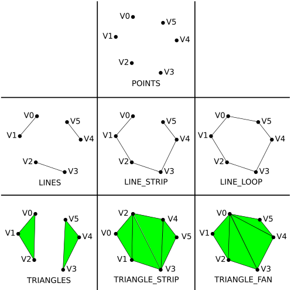

## OpenGL Cheat Sheet


### 📑 Table of Contents

<div style="display: flex; flex-wrap: wrap;">

<div style="flex: 1; min-width: 250px; margin-right: 20px;">
<ul>
<li><strong>🏗️ Program Structure</strong></li>
<ul>
<li><a href="#⚙️-glfw-initialization">⚙️ GLFW Initialization</a></li>
<li><a href="#🔌-glad-loading">🔌 GLAD Loading</a></li>
<li><a href="#🧱-program-structure-overview">🧱 Program Structure Overview</a></li>
</ul>

<li><strong>🎞️ Rendering Pipeline</strong></li>
<ul>
<li><a href="#🚀-gpu-pipeline-overview">🚀 GPU Pipeline Overview</a></li>
<li><a href="#📦-vao-vbo-ebo">📦 VAO / VBO / EBO</a></li>
<li><a href="#🔁-front--back-buffers">🔁 Front & Back Buffers</a></li>
</ul>

<li><strong>🎨 Shaders & GLSL</strong></li>
<ul>
<li><a href="#🧠-shader-basics">🧠 Shader Basics</a></li>
<li><a href="#🌈-glsl-syntax--data-types">🌈 GLSL Syntax & Data Types</a></li>
<li><a href="#🔗-uniforms--inputs--outputs">🔗 Uniforms, Inputs & Outputs</a></li>
<li><a href="#🔗-using-uniform-variables-in-c-code">🔗 Using Uniform Variables in C++ Code</a></li>
</ul>

<li><strong>🧩 Drawing & Primitives</strong></li>
<ul>
<li><a href="#📐-primitives">📐 Primitives</a></li>
<li><a href="#🔺-triangle-face-orientation">🔺 Triangle Face Orientation</a></li>
<li><a href="#🖼️-drawing-functions">🖼️ Drawing Functions</a></li>
</ul>

</div>

<div style="flex: 1; min-width: 250px;">

<li><strong>🧮 Transformation Matrices</strong></li>
<ul>
<li><a href="#🧠-why-3×3-or-4×4-matrices">🧠 Why 3×3 or 4×4 Matrices?</a></li>
<li><a href="#🧩-glm-library">🧩 GLM Library</a></li>
<li><a href="#🔗-sending-matrices-to-shaders">🔗 Sending Matrices to Shaders</a></li>
<li><a href="#🔄-transformation-composition">🔄 Transformation Composition</a></li>
<li><a href="#🧮-math-behind-transformations">🧮 Math Behind Transformations</a></li>
</ul>

<li><strong>🧵 Textures</strong></li>
<ul>
<li><a href="#🖼️-texels-vs-pixels">🖼️ Texels vs Pixels</a></li>
<li><a href="#📦-texture-coordinates-s-t">📦 Texture Coordinates (s, t)</a></li>
<li><a href="#🧰-stb_imageh">🧰 stb_image.h</a></li>
<li><a href="#🧱-texture-setup-functions-in-opengl">🧱 Texture Setup Functions in OpenGL</a></li>
<li><a href="#🧩-using-textures-in-c-code">🧩 Using Textures in C++ Code</a></li>
</ul>

<li><strong>📘 Function Reference</strong></li>
<ul>
<li><a href="#⚙️-glfw-functions">⚙️ GLFW Functions</a></li>
<li><a href="#🔌-glad-functions">🔌 GLAD Functions</a></li>
<li><a href="#🧱-opengl-buffer-functions">🧱 OpenGL Buffer Functions</a></li>
<li><a href="#🎨-shader-functions">🎨 Shader Functions</a></li>
<li><a href="#🖼️-rendering--state-functions">🖼️ Rendering & State Functions</a></li>
</ul>
</ul>
</div>

</div>

## 🏗️ Program Structure

### ⚙️ GLFW Initialization

GLFW is a **windowing and input library** that creates an **OpenGL context** and handles **keyboard/mouse events**.

#### Key Functions

##### `glfwInit()`

- Initializes the GLFW library.
- **Must be called before any other GLFW function.**
- Returns `GLFW_TRUE` (success) or `GLFW_FALSE` (failure).

##### `glfwWindowHint(hint, value)`

- Sets configuration hints before creating the window.
- Common hints:

  - `GLFW_CONTEXT_VERSION_MAJOR`, `GLFW_CONTEXT_VERSION_MINOR`: specify OpenGL version (e.g. `3`, `3` for OpenGL 3.3).
  - `GLFW_OPENGL_PROFILE`:

    - `GLFW_OPENGL_CORE_PROFILE` (modern OpenGL, no deprecated functions)
    - `GLFW_OPENGL_COMPAT_PROFILE` (legacy compatibility)

  - `GLFW_RESIZABLE`: `GLFW_TRUE` or `GLFW_FALSE`.

##### `glfwCreateWindow(width, height, title, monitor, share)`

- Creates a window and an OpenGL context.

  - `width`, `height`: in pixels
  - `title`: window name
  - `monitor`: `nullptr` for windowed mode, or a monitor handle for fullscreen
  - `share`: another window to share resources with, or `nullptr`

- Returns a pointer to a `GLFWwindow` object.

##### `glfwMakeContextCurrent(window)`

- Makes the specified window’s OpenGL context the current one for this thread.
- **Required before calling any GLAD/OpenGL functions.**

##### `glfwWindowShouldClose(window)`

- Returns `true` if the user closed the window or requested termination.

##### `glfwPollEvents()`

- Processes window events (keyboard, mouse, close, resize, etc.) in the event queue.

##### `glfwSwapBuffers(window)`

- Swaps the **front** and **back** buffers to display the rendered image.

##### `glfwTerminate()`

- Cleans up and frees all GLFW resources.

### 🔌 GLAD Loading

GLAD is an **OpenGL function loader**.
OpenGL only defines function names, not their memory addresses — GLAD loads those addresses dynamically.

##### `gladLoadGL()`

- Loads all OpenGL function pointers for the current context.
- **Must be called after** `glfwMakeContextCurrent(window)`.

### 🧱 Program Structure Overview

1. **Initialize GLFW**
2. **Set version/profile hints**
3. **Create window**
4. **Make context current**
5. **Load OpenGL with GLAD**
6. **Define viewport with `glViewport()`**
7. **Create and compile shaders**
8. **Generate and bind VAO/VBO/EBO**
9. **Upload vertex data**
10. **Configure vertex attributes**
11. **Render loop** (`while(!glfwWindowShouldClose)`)
12. **Delete resources and terminate**

## 🎞️ Rendering Pipeline

### 🚀 GPU Pipeline Overview

| Stage                  | Description                                                                                |
| :--------------------- | :----------------------------------------------------------------------------------------- |
| **CPU Stage**          | Your C++ code runs on the CPU, creating buffers, shaders, and sending commands to the GPU. |
| **Vertex Shader**      | Executes per-vertex; transforms input vertex data and outputs to the next stage.           |
| **Primitive Assembly** | Groups vertices into primitives (triangles, lines, points).                                |
| **Rasterization**      | Converts primitives into fragments (potential pixels).                                     |
| **Fragment Shader**    | Executes per-fragment; outputs the final color for each pixel.                             |
| **Framebuffer**        | The color results are stored here before being displayed.                                  |

### 📦 VAO / VBO / EBO

| Object                                         | Purpose                                                               | Bound Target              |
| ---------------------------------------------- | --------------------------------------------------------------------- | ------------------------- |
| **VBO** (Vertex Buffer Object)                 | Stores vertex data (positions, colors, etc.) in GPU memory.           | `GL_ARRAY_BUFFER`         |
| **EBO** (Element Buffer Object / Index Buffer) | Stores vertex indices to avoid duplication.                           | `GL_ELEMENT_ARRAY_BUFFER` |
| **VAO** (Vertex Array Object)                  | Stores the vertex attribute configuration and which VBO/EBO are used. | N/A                       |

### 🔁 Front & Back Buffers

- OpenGL uses **double buffering**:

  - **Front Buffer:** currently displayed image.
  - **Back Buffer:** image currently being drawn into.

- After rendering:

  - `glfwSwapBuffers(window)` swaps them, showing the new image instantly without flicker.

## 🎨 Shaders & GLSL

### 🧠 Shader Basics

- **Shaders** are small programs running on the GPU.
- Written in **GLSL (OpenGL Shading Language)**.
- Two main types (for now):

  - **Vertex Shader:** processes vertices.
  - **Fragment Shader:** computes pixel color.

### 🌈 GLSL Syntax & Data Types

#### Basic Types

| GLSL Type              | Description                           |
| ---------------------- | ------------------------------------- |
| `float`, `int`, `bool` | Scalar numeric types                  |
| `vec2`, `vec3`, `vec4` | 2D, 3D, 4D float vectors              |
| `mat2`, `mat3`, `mat4` | 2×2, 3×3, 4×4 float matrices          |
| `sampler2D`            | Texture reference (not used here yet) |

#### Qualifiers

| Qualifier              | Meaning                                                            |
| ---------------------- | ------------------------------------------------------------------ |
| `in`                   | Input variable (e.g., vertex attribute in vertex shader)           |
| `out`                  | Output variable (e.g., color output in fragment shader)            |
| `uniform`              | Global variable shared across all shader invocations, set from CPU |
| `layout(location = X)` | Binds attribute index X to a variable                              |

### 🔗 Uniforms, Inputs & Outputs

- **`uniform`** variables are set once per draw call and stay constant for all vertices/fragments.
- Commonly used for:

  - Colors
  - Time
  - Resolution
  - Transformation matrices (later)

Example syntax:

```glsl
uniform vec4 color;
out vec4 FragColor;
void main() {
    FragColor = color;
}
```

## 🔗 Using Uniform Variables in C++ Code

Uniforms are global GPU variables shared across all vertices/fragments during a draw call.

After you declare a uniform in GLSL, e.g.:

```glsl
uniform float uTime;
uniform vec4 uColor;
uniform mat4 uTransform;
```

you can modify them from your C++ program:

#### 1️⃣ Get the location

```cpp
GLuint location = glGetUniformLocation(shaderProgram, "uColor");
```

- **shaderProgram:** ID of your linked program.
- **"uColor":** name of the uniform in GLSL.
- Returns an integer **location index** (or `-1` if not found).

#### 2️⃣ Send data to GPU

Depending on the uniform type:

| Type    | Function                                                            | Parameters                               |
| ------- | ------------------------------------------------------------------- | ---------------------------------------- |
| `float` | `glUniform1f(location, value)`                                      | single float                             |
| `int`   | `glUniform1i(location, value)`                                      | integer (often for texture unit indices) |
| `vec2`  | `glUniform2f(location, x, y)`                                       | two floats                               |
| `vec3`  | `glUniform3f(location, x, y, z)`                                    | three floats                             |
| `vec4`  | `glUniform4f(location, x, y, z, w)`                                 | four floats                              |
| `mat3`  | `glUniformMatrix3fv(location, count, transpose, value_ptr(matrix))` | 3×3 matrix                               |
| `mat4`  | `glUniformMatrix4fv(location, count, transpose, value_ptr(matrix))` | 4×4 matrix                               |

> `transpose` should almost always be `GL_FALSE` when using GLM.
> You can pass GLM matrices using `glm::value_ptr(matrix)` (from `<glm/gtc/type_ptr.hpp>`).

## 🧩 Drawing & Primitives

### 📐 Primitives

| Constant            | Description                           | Vertices per primitive |
| ------------------- | ------------------------------------- | ---------------------- |
| `GL_POINTS`         | Single points                         | 1                      |
| `GL_LINES`          | Independent lines                     | 2                      |
| `GL_LINE_STRIP`     | Connected line segments               | ≥2                     |
| `GL_TRIANGLES`      | Independent triangles                 | 3                      |
| `GL_TRIANGLE_STRIP` | Connected triangles (shared vertices) | ≥3                     |
| `GL_TRIANGLE_FAN`   | Fan-like triangles around a center    | ≥3                     |



## 🔺 Triangle Face Orientation

In OpenGL, **the order of vertex specification determines which face is front or back**.

- When drawing a triangle, OpenGL calculates the face orientation based on the **winding order** of vertices:

  - **Counter-Clockwise (CCW)** → **Front Face**
  - **Clockwise (CW)** → **Back Face**

This is used for **back-face culling**, where triangles facing away from the camera can be ignored to improve performance.

### Related Functions

#### `glFrontFace(mode)`

- Defines which winding order represents the front face.

  - `GL_CCW` (default) – Counter-clockwise vertices define front face.
  - `GL_CW` – Clockwise vertices define front face.

#### `glCullFace(mode)`

- Specifies which faces to cull:

  - `GL_BACK`, `GL_FRONT`, or `GL_FRONT_AND_BACK`.

#### `glEnable(GL_CULL_FACE)`

- Enables face culling.

### 🖼️ Drawing Functions

#### `glDrawArrays(mode, first, count)`

- Draws primitives directly from the VBO.

  - **mode:** Primitive type (`GL_TRIANGLES`, etc.)
  - **first:** Starting index
  - **count:** Number of vertices to draw

#### `glDrawElements(mode, count, type, indices)`

- Draws primitives using indices from EBO.

  - **mode:** Primitive type
  - **count:** Number of indices
  - **type:** Type of indices (`GL_UNSIGNED_INT`, `GL_UNSIGNED_SHORT`)
  - **indices:** Offset/pointer in EBO (usually `0`)

## 📘 Function Reference

### ⚙️ GLFW Functions

(in addition to those above)

- `glfwSetFramebufferSizeCallback(window, callback)`

  - Registers a function to handle window resizing (to update the viewport).

### 🔌 GLAD Functions

- `gladLoadGL()` – loads OpenGL functions.
- `GLVersion.major`, `GLVersion.minor` – holds loaded OpenGL version.

### 🧱 OpenGL Buffer Functions

#### `glGenBuffers(n, *buffers)`

- Generates `n` buffer object names.
- **buffers:** pointer to an array to store IDs.

#### `glBindBuffer(target, buffer)`

- Binds a buffer to a target.

  - `target`: `GL_ARRAY_BUFFER` or `GL_ELEMENT_ARRAY_BUFFER`
  - `buffer`: buffer ID returned from `glGenBuffers`

#### `glBufferData(target, size, data, usage)`

- Allocates and initializes buffer memory.

  - `target`: buffer type
  - `size`: byte size of the data
  - `data`: pointer to the vertex or index array (can be `nullptr`)
  - `usage`: usage hint (`GL_STATIC_DRAW`, `GL_DYNAMIC_DRAW`, `GL_STREAM_DRAW`)

#### `glGenVertexArrays(n, *arrays)`

- Generates `n` VAOs.

#### `glBindVertexArray(array)`

- Binds a VAO to make it active.

#### `glVertexAttribPointer(index, size, type, normalized, stride, pointer)`

- Describes how vertex data is laid out in memory.

  - `index`: layout location in shader
  - `size`: number of components (e.g., 3 for `vec3`)
  - `type`: data type (`GL_FLOAT`, `GL_INT`)
  - `normalized`: normalize integer data (`GL_TRUE`/`GL_FALSE`)
  - `stride`: byte offset between vertices
  - `pointer`: offset to first component (casted to `void*`)


#### `glEnableVertexAttribArray(index)`

- Enables the vertex attribute at the specified index.

#### `glDeleteBuffers(n, *buffers)`

#### `glDeleteVertexArrays(n, *arrays)`

- Deletes the specified OpenGL objects.

### 🎨 Shader Functions

#### `glCreateShader(type)`

- Creates an empty shader object.

  - `type`: `GL_VERTEX_SHADER` or `GL_FRAGMENT_SHADER`.

#### `glShaderSource(shader, count, *string, *length)`

- Loads GLSL source code into a shader.

  - `count`: number of source strings
  - `*string`: pointer to array of C strings
  - `*length`: optional lengths (or `nullptr`)

#### `glCompileShader(shader)`

- Compiles GLSL source to GPU instructions.

#### `glCreateProgram()`

- Creates a shader program container.

#### `glAttachShader(program, shader)`

- Attaches a compiled shader to a program.

#### `glLinkProgram(program)`

- Links attached shaders into a final executable.

#### `glUseProgram(program)`

- Activates a shader program for rendering.

#### `glDeleteShader(shader)`

- Deletes the shader object (safe after linking).

#### `glDeleteProgram(program)`

- Deletes the linked program.

#### `glGetShaderiv(shader, pname, *params)`

- Queries a shader’s compile status.

  - `pname`: `GL_COMPILE_STATUS`, `GL_INFO_LOG_LENGTH`, etc.

#### `glGetShaderInfoLog(shader, bufSize, *length, *infoLog)`

- Retrieves shader compilation errors/warnings.

### 🖼️ Rendering & State Functions

#### `glViewport(x, y, width, height)`

- Defines the region of the window OpenGL renders to.

#### `glClearColor(r, g, b, a)`

- Sets the color used when clearing the color buffer.

#### `glClear(mask)`

- Clears the specified buffers.

  - `mask`: bitwise OR of `GL_COLOR_BUFFER_BIT`, `GL_DEPTH_BUFFER_BIT`, etc.

#### `glfwSwapBuffers(window)`

- Swaps the front and back buffers.

#### `glfwPollEvents()`

- Handles pending window events.

# 🧮 Transformation Matrices

Transformations allow you to move, rotate, or scale objects in 2D/3D space.
They are represented by **matrices** that operate on **homogeneous coordinates**.

## 🧠 Why 3×3 or 4×4 Matrices?

A vertex in 2D normally has 2 coordinates `(x, y)`.
However, to support translation (which cannot be represented by 2×2 linear matrices),
we add a **homogeneous coordinate** `w`, forming `(x, y, 1)`.

Thus:

- **2D transformations** use **3×3 matrices**
- **3D transformations** use **4×4 matrices**

This enables combining all transformations (translation, rotation, scale) into a **single matrix multiplication**.

Homogeneous coordinates allow translation to be expressed as matrix multiplication.

Example for 2D translation matrix (3×3):

[
T =
\begin{bmatrix}
1 & 0 & tx \
0 & 1 & ty \
0 & 0 & 1
\end{bmatrix}
]

and a point:

[
p =
\begin{bmatrix}
x \
y \
1
\end{bmatrix}
]

Result:
[
p' = T \times p
]

## 🧩 GLM Library

GLM is a **header-only math library** designed for OpenGL, following GLSL conventions.

### Common Functions

#### `glm::translate(matrix, glm::vec3( tx, ty, tz ))`

Applies a translation.
The resulting matrix moves objects by `(tx, ty, tz)`.

#### `glm::scale(matrix, glm::vec3( sx, sy, sz ))`

Applies a scaling transformation.

#### `glm::rotate(matrix, angle, glm::vec3( x, y, z ))`

Applies a rotation (angle in radians) around the given axis.

#### `glm::ortho(left, right, bottom, top, near, far)`

Creates an **orthographic projection matrix** for 2D rendering.
Projects coordinates directly without perspective distortion.

[
\text{matrix} =
\begin{bmatrix}
\frac{2}{r-l} & 0 & 0 & -\frac{r+l}{r-l} \
0 & \frac{2}{t-b} & 0 & -\frac{t+b}{t-b} \
0 & 0 & -\frac{2}{f-n} & -\frac{f+n}{f-n} \
0 & 0 & 0 & 1
\end{bmatrix}
]

### 🔗 Sending Matrices to Shaders

In your vertex shader:

```glsl
uniform mat4 uTransform;
layout(location = 0) in vec3 aPos;
void main() {
    gl_Position = uTransform * vec4(aPos, 1.0);
}
```

In C++:

```cpp
GLuint loc = glGetUniformLocation(shaderProgram, "uTransform");
glUniformMatrix4fv(loc, 1, GL_FALSE, glm::value_ptr(transform));
```

## 🔄 Transformation Composition

When combining transformations (e.g., scale, then rotate, then translate),
the **order of multiplication matters** — **composition happens from right to left**.

[
M = T \times R \times S
]

When applied:
[
v' = M \times v = T \times R \times S \times v
]

So the vertex is **scaled first**, then **rotated**, then **translated**.

## 🧮 Math Behind Transformations

### Matrix-Vector Multiplication

For a 4×4 matrix `M` and a 4D vector `v`:

[
v' = M \times v
]

Each vertex is multiplied by the same transformation matrix inside the **vertex shader**.
This allows the GPU to apply the same transformation efficiently across millions of vertices.

### Composition of Transformations

Matrix multiplication combines transformations into one:
[
M = T \times R \times S
]
This avoids recalculating transformations on the CPU and lets the GPU do it per vertex.

# 🧵 Textures

Textures are **images** mapped onto geometry.
Each pixel of the geometry can take its color from a pixel (texel) of the texture image.

## 🖼️ Texels vs Pixels

- **Texel:** Texture element (pixel in the texture image).
- **Pixel:** Screen element (pixel on your display).
- OpenGL interpolates and filters texels to determine pixel color.

### Filtering

When texels ≠ pixels:

- **Minification filter:** texture smaller than object → `GL_NEAREST`, `GL_LINEAR`
- **Magnification filter:** texture larger than object → `GL_NEAREST`, `GL_LINEAR`

## 📦 Texture Coordinates (s, t)

Each vertex has texture coordinates `(s, t)` (range [0, 1]) which tell OpenGL how to map texture pixels onto geometry.

Stored in the **VBO** as part of each vertex’s attributes:

```cpp
{ x, y, z, s, t }
```

In the **vertex shader**:

```glsl
layout(location = 1) in vec2 aTexCoord;
out vec2 TexCoord;
void main() {
    TexCoord = aTexCoord;
}
```

In the **fragment shader**:

```glsl
in vec2 TexCoord;
uniform sampler2D uTexture;
out vec4 FragColor;
void main() {
    FragColor = texture(uTexture, TexCoord);
}
```

## 🧰 stb_image.h

`stb_image.h` is a single-header image loading library used to read texture files.

### Common Functions

#### `stbi_load(filename, *x, *y, *channels, desired_channels)`

- Loads an image file into memory.

  - `filename`: path to image file.
  - `*x`, `*y`: output width and height.
  - `*channels`: number of color channels in the file.
  - `desired_channels`: if non-zero, force image to that many channels (e.g., `4` for RGBA).

- Returns a pointer to the pixel data.

#### `stbi_image_free(data)`

- Frees the memory allocated by `stbi_load`.

#### `stbi_set_flip_vertically_on_load(true)`

- Flips image vertically so it matches OpenGL texture coordinate orientation (OpenGL expects (0,0) bottom-left).

## 🧱 Texture Setup Functions in OpenGL

#### `glGenTextures(n, *textures)`

Generates texture object IDs.

#### `glBindTexture(target, texture)`

Binds a texture to a target (`GL_TEXTURE_2D`).

#### `glTexImage2D(target, level, internalFormat, width, height, border, format, type, data)`

Uploads image data to the GPU.

- `level`: mipmap level (0 = base)
- `internalFormat`: format stored in GPU (`GL_RGB`, `GL_RGBA`)
- `format`: input format of data
- `type`: data type (`GL_UNSIGNED_BYTE`)
- `data`: pointer to image pixels

#### `glGenerateMipmap(target)`

Generates mipmaps (lower-resolution versions of the texture).

#### `glTexParameteri(target, pname, param)`

Sets texture parameters:

- `GL_TEXTURE_WRAP_S` / `GL_TEXTURE_WRAP_T`: how to repeat the texture (`GL_REPEAT`, `GL_CLAMP_TO_EDGE`)
- `GL_TEXTURE_MIN_FILTER` / `GL_TEXTURE_MAG_FILTER`: filtering mode

## 🧩 Using Textures in C++ Code

```cpp
GLuint texture;
glGenTextures(1, &texture);
glBindTexture(GL_TEXTURE_2D, texture);
stbi_set_flip_vertically_on_load(true);
unsigned char* data = stbi_load("image.png", &width, &height, &nrChannels, 0);
if (data) {
    glTexImage2D(GL_TEXTURE_2D, 0, GL_RGBA, width, height, 0, GL_RGBA, GL_UNSIGNED_BYTE, data);
    glGenerateMipmap(GL_TEXTURE_2D);
}
stbi_image_free(data);
```

Then bind texture and set uniform before drawing:

```cpp
glUseProgram(shaderProgram);
glActiveTexture(GL_TEXTURE0);
glBindTexture(GL_TEXTURE_2D, texture);
glUniform1i(glGetUniformLocation(shaderProgram, "uTexture"), 0);
```
